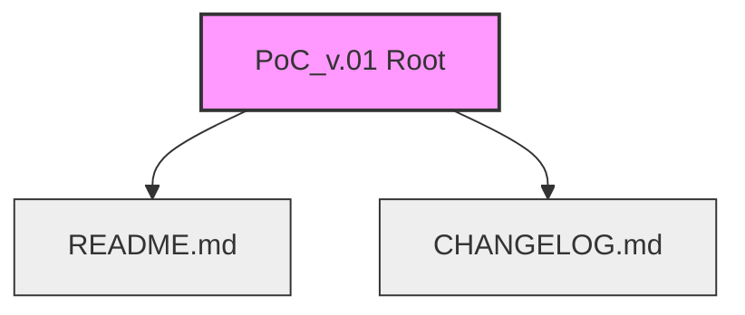

# Architecture Reference: PoC_v.01

## 1. High-Level Overview
**PoC_v.01** is a repository currently in its **Genesis/Initialization Phase**. As a "Proof of Concept" (PoC) version 0.01, it represents a greenfield environment established to define the project scope, objectives, and history tracking before the introduction of implementation code.

The current architecture is **Documentation-Centric**, prioritizing the establishment of project governance (via `README`) and version history tracking (via `CHANGELOG`) prior to technology stack selection.

## 2. Repository Structure
The project follows a minimal, root-level structure designed for immediate accessibility.

### File Definitions
*   **`README.md`**: The single source of truth for the project's purpose, scope, and planned usage. It serves as the entry point for all developers and stakeholders.
*   **`CHANGELOG.md`**: A chronological log of changes. In this early stage (v.01), this file is critical for tracking architectural decisions and initial setup steps even before code is committed.

## 3. Technology Stack
*   **Current State:** Stack Agnostic
*   **Manifest Status:** No dependency manifests (e.g., `package.json`, `requirements.txt`) are currently present.
*   **Implication:** The project is currently independent of specific runtime environments or compilers. It is purely informational.

## 4. Architectural Pattern
Currently, the project utilizes a **Scaffolding Pattern**.

*   **Phase:** Pre-Alpha / Ideation.
*   **Design Philosophy:** "Documentation First." This approach ensures that the "Why" and "What" are defined in text files before the "How" is defined in code.

## 5. Development Workflow
Since no build pipeline or CI/CD is established, the workflow is manual and documentation-driven:

1.  **Ideation:** Goals are defined.
2.  **Documentation:** `README.md` is updated to reflect the new goals.
3.  **Versioning:** The initialization is logged in `CHANGELOG.md`.

## 6. Future Architectural Roadmap
*To be determined upon selection of the implementation stack.* 

Pending decisions:
*   **Language:** (TBD)
*   **Framework:** (TBD)
*   **Data Layer:** (TBD)